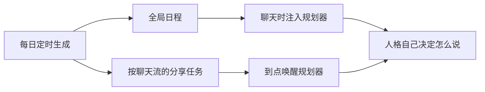

# 麦麦生活

[](https://github.com/tsuiraku9/mai-life)
[](https://github.com/Mai-with-u/MaiBot)
[](#依赖)
[](LICENSE)

MaiBot 第三方插件：每天按可配置提示词生成角色日程，以及要在聊天里分享的事情和提醒时间。聊天时把最近几条日程注入规划器；到点唤醒规划器，由人格决定说不说、怎么说。

日程是角色全局一份。聊天流白名单只决定「在哪些对话里注入」和「在哪些对话里提醒」。

## 目录

- [它做什么](#它做什么)
- [安装](#安装)
- [快速开始](#快速开始)
- [配置](#配置)
- [命令](#命令)
- [规划器工具](#规划器工具)
- [测试](#测试)
- [依赖](#依赖)
- [协议](#协议)

## 它做什么

| 方面 | 日程 | 分享提醒 |
| --- | --- | --- |
| 数据 | 全角色一份 | 每个启用的聊天流各自一份 |
| 生成 | 每天定时，可参考人设、聊天、记忆和近几日安排 | 贴合该聊天流的关系和语境 |
| 生效方式 | 聊天时注入规划器上下文 | 到点唤醒规划器，不套模板发言 |
| 白名单为空 | 不注入、规划器也查不到 | 不生成、不到点唤醒 |

规划器只暴露两个工具：`mai_life_query`、`mai_life_modify`。提示词都可以在 WebUI 里改。



## 安装

把本仓库放到 MaiBot 的 `plugins/mai-life` 目录后重启。Docker 部署时，插件目录一般对应容器内 `/MaiMBot/plugins`。

启动后到 WebUI 启用插件，填管理员、日程白名单，并在分享提醒里加上要启用的聊天流。

> [!IMPORTANT]
> `config.toml` 由 Runner 根据配置模型自动生成。不要手工复制进仓库，也不要提交本地 `config.toml`。

## 快速开始

1. WebUI 打开插件，把 **启用插件** 打开。
2. **管理员** 填 `platform:user_id`，例如 `qq:123456` 或 `webui:webui_user_xxx`。不填的话，聊天里谁都不能用命令。
3. **日程 → 启用的聊天流** 写上要注入日程的对话。
4. **分享提醒 → 启用的聊天流** 添加条目，每个聊天流可以单独设条数和额外提示词。
5. 用管理员账号发 `/mai_life_generate`，再用 `/mai_life_show` 核对今天的日程和全部分享任务。

最小可用配置可以长这样：

```toml
[plugin]
enabled = true
admin_user_ids = ["qq:123456"]

[schedule]
allowed_streams = ["qq:private:123456"]

[[share.stream_profiles]]
stream = "qq:private:123456"
count_min = 2
count_max = 4
extra_prompt = "只聊日常小事，不要提工作。"
```

## 配置

配置在 WebUI 里改即可。下面只列常用项，完整字段以 WebUI 和 `config.example.toml` 为准。

### 插件

| 项 | 默认 | 说明 |
| --- | --- | --- |
| `plugin.enabled` | `false` | 总开关。关掉后停止生成、注入和到点唤醒 |
| `plugin.admin_user_ids` | `[]` | 允许使用命令的管理员。格式 `platform:user_id` |

管理员名单为空时，聊天用户不能使用任何 `/mai_life_*` 命令；本地控制台操作员始终可用。

### 每日生成

| 项 | 默认 | 说明 |
| --- | --- | --- |
| `generation.time` | `01:30` | 每天生成时刻，`HH:MM` |
| `generation.timezone` | `local` | `local` 或 `Asia/Shanghai` 这类 IANA 时区 |
| `generation.model` | `planner` | 生成用的模型任务名，空则用 Host 默认 |
| `generation.generate_on_load_if_missing` | `true` | 启动时如果今天还没有记录，立刻补生成 |
| `generation.include_persona` | `true` | 是否读入 MaiBot 人设，再和下方补充人设拼接 |
| `generation.extra_persona` | 空 | 补充人设。关闭读入人设时，只使用这一段 |
| `generation.include_history` | `true` | 生成时是否读最近聊天 |
| `generation.include_knowledge` | `true` | 生成时是否检索记忆 |
| `generation.knowledge_window_hours` | `168` | 记忆时间窗（小时），`0` 表示不限 |

### 日程

| 项 | 默认 | 说明 |
| --- | --- | --- |
| `schedule.enabled` | `true` | 关闭后不再生成日程，也不再注入 |
| `schedule.allowed_streams` | `[]` | 启用日程注入与查询/修改的聊天流 |
| `schedule.activity_count_min` / `max` | `8` / `14` | 每天生成的活动条数范围 |
| `schedule.wake_time` / `sleep_time` | `08:00` / `01:00` | 角色通常的作息，给生成模型参考 |
| `schedule.recent_days` | `3` | 生成时附带最近几天已有日程，减少天天雷同；`0` 表示不附带 |
| `schedule.recent_inject_count` | `3` | 每次规划时注入最近几条 |
| `schedule.inject_window_minutes` | `180` | 优先取当前时间前后这个窗口内的活动 |

### 分享提醒

每个聊天流单独生成一份任务。条数和额外提示词写在该聊天流自己的配置里。

| 项 | 默认 | 说明 |
| --- | --- | --- |
| `share.enabled` | `true` | 关闭后不再生成分享任务，也不再到点唤醒 |
| `share.stream_profiles` | `[]` | 启用的聊天流列表 |
| `share.wake_planner` | `true` | 到点后是否唤醒对应聊天流的规划器 |
| `share.patrol_interval_seconds` | `60` | 检查任务是否到期的间隔 |
| `share.cooldown_seconds` | `180` | 同一聊天流两次唤醒的最小间隔 |
| `share.silence_start` / `silence_end` | `00:00` / `07:30` | 静默时段。生成时不会把提醒排进这个区间；开始与结束相同表示不设静默。已经生成的提醒仍会到点发出 |

`stream_profiles` 每一项：

| 项 | 默认 | 说明 |
| --- | --- | --- |
| `stream` | 空 | 聊天流标识，填了即启用 |
| `count_min` / `count_max` | `3` / `6` | 该聊天流每天生成条数 |
| `extra_prompt` | 空 | 只作用于该聊天流，会拼到分享生成提示词后面 |

### 聊天流写法

日程白名单和分享启用名单用同一套写法。对应名单为空时，该功能不对任何聊天流生效。

| 写法 | 例子 |
| --- | --- |
| 全部聊天流 | `all` |
| 会话 ID | `session:<session_id>`，或直接写裸 `session_id` |
| 群 | `qq:group:123` |
| 私聊 | `qq:private:456` |
| 平台 + 用户 | `webui:webui_user_xxx` |

管理员 ID 只认 `platform:user_id`，例如 `qq:123456`。不要写成群号。

### 提示词

`prompts` 分组里可以改日程生成、分享生成、修改、注入文本和唤醒意图。留空则回退到内置默认模板。未知占位符会原样保留。

工具的 `description` 写在代码里，改配置不会热更新工具描述。

<details>
<summary>占位符</summary>

| 占位符 | 含义 |
| --- | --- |
| `{date}` `{weekday}` `{now}` `{timezone}` | 日期、星期、当前时间、时区 |
| `{bot_nickname}` `{persona}` | 角色名、人设 |
| `{history}` `{knowledge}` | 最近聊天、记忆检索结果 |
| `{yesterday_tail}` `{recent_days}` `{recent_days_schedule}` | 昨日收束、参考天数、近几日日程 |
| `{schedule_json}` `{share_json}` `{recent_schedule}` | 日程 / 分享 JSON、注入用的近期日程 |
| `{wake_time}` `{sleep_time}` | 作息 |
| `{activity_count_min}` `{activity_count_max}` | 日程条数范围 |
| `{share_count_min}` `{share_count_max}` | 当前聊天流的分享条数范围 |
| `{silence_start}` `{silence_end}` | 静默时段 |
| `{stream_info}` `{stream_id}` `{extra_prompt}` | 当前聊天流信息、ID、该流额外提示词 |
| `{share_item}` | 到点唤醒时的分享内容 |
| `{user_request}` `{target}` `{action}` | 修改请求、目标、动作 |

</details>

## 命令

只有 `plugin.admin_user_ids` 里的管理员能用。名单为空时，聊天里的用户都不能用命令；本地控制台操作员始终可用。

| 命令 | 说明 |
| --- | --- |
| `/mai_life_help` | 帮助 |
| `/mai_life_status` | 开关、今日条数、未提醒数量 |
| `/mai_life_generate` | 立即生成今日记录 |
| `/mai_life_show` | 查看今日日程，以及所有聊天流的分享任务 |
| `/mai_life_wake` | 对当前聊天流立刻唤醒规划器（测试用） |

## 规划器工具

| 工具 | 用途 | 参数 |
| --- | --- | --- |
| `mai_life_query` | 查询日程和分享时间 | `date` 可选，`YYYY-MM-DD`；`target` 为 `schedule` / `share` / `both` |
| `mai_life_modify` | 修改日程或分享时间 | `target` + `action`（`add` / `update` / `delete` / `replace_day`）+ `request` |

当前聊天流不在对应白名单里时，工具会拒绝查询或修改该功能。

## 测试

离线：

```powershell
python -m pytest tests -q
```

联调：

1. 把插件放到 MaiBot 的 `plugins` 目录并启动。
2. WebUI 启用插件，填写管理员、日程白名单，并在分享提醒的「启用的聊天流」里添加聊天流。
3. 用管理员账号发 `/mai_life_generate`，再用 `/mai_life_show` 查看全部聊天流的分享任务。
4. 正常聊天，看规划器 prompt 日志里有没有「当前生活日程」。
5. 问「你今天干什么」，规划器应调用 `mai_life_query`。
6. 说「下午三点改成学习」，规划器应调用 `mai_life_modify`。
7. 把某条分享任务的时间改到下一分钟，规划器应被唤醒，而且不是固定模板发言。
8. 关闭插件后后台循环应停止；白名单为空时不注入、不唤醒。

## 依赖

- MaiBot >= 1.2.3
- maibot-plugin-sdk >= 2.7.1

## 协议

[MIT](LICENSE)
